# The Mad Mouse

## Documentation:

### Screen Recording

End1:[Video Link End 1](https://drive.google.com/file/d/1J0aRza7eCRiXcW9tX9-1OsQq_UlL7cyj/view?usp=sharing)

End2:[Video Link End 2](https://drive.google.com/file/d/1g6fGU2-Kg1ak6Ng9e6liIqmdPmYcCoiZ/view?usp=sharing)

### Thematic Plot Description

You're a scientist working on finding a cure to all the diseases by experimenting on rats. You experiment with the rats in your basement and have been getting good results with it. The world calls you "Mad Scientist" but you know what you're doing will help all of humanity. One day you're just sitting in your room, and suddenly the lights go out. You hear some clattering coming from the basement. You're confused and curious as to what that noise was. You go to the lab- it's dark- so you grab your torch light. You flash your torch and walk towards the switch to turn on the emergency light. The computer warns you that there is something wrong with the subject mice. You want to check what it is.
Two Ends of this experience:

- You directly pull the lever to open the cage and find that the mouse becomes way bigger and more furious than expected. It attacked you. You die.
- You are very cautious. You grab a weapon and then open the gate. When the mouse jumps at you, you shoot it and you survive.

### Interaction & Screenshots:

1. Grab the flashlight to obtain a minimal light source to find the switch for emergency electricity power.

Flashlight            |  Button for light
:-------------------------:|:-------------------------:
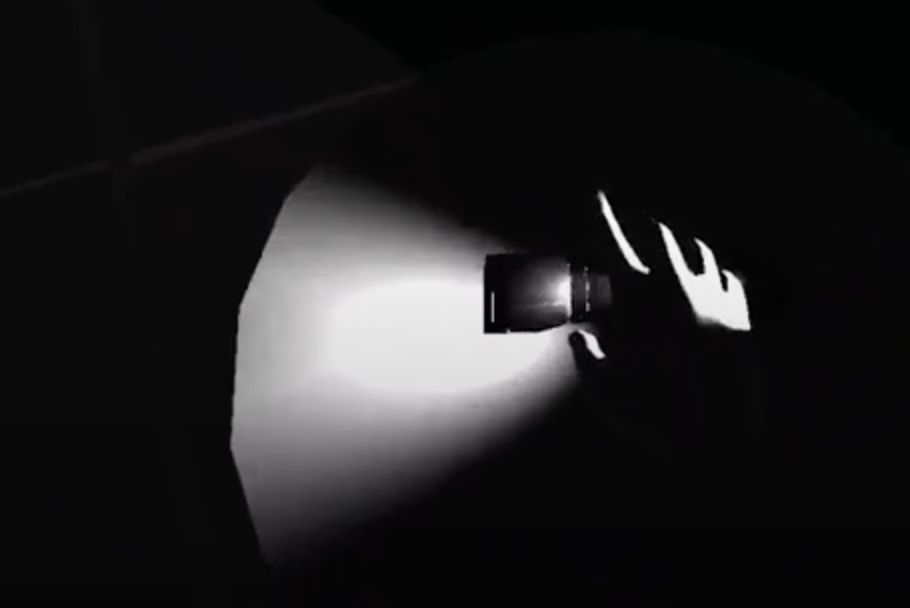  |  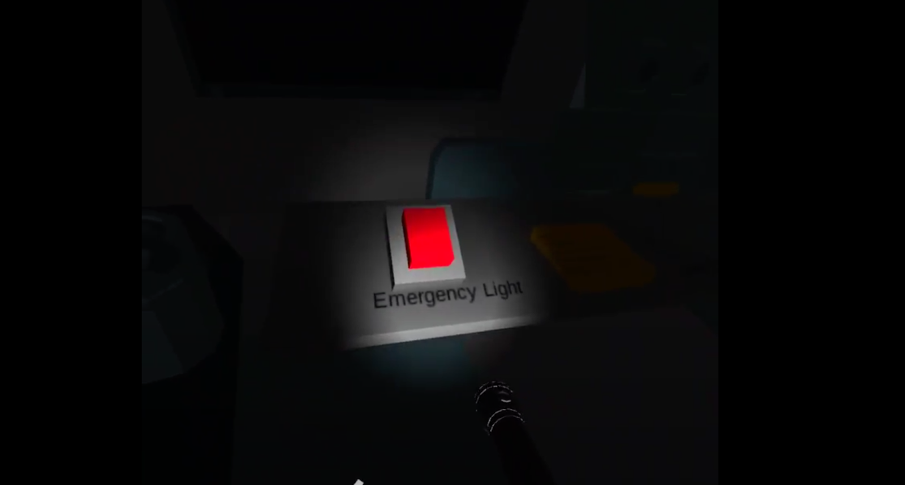

2. Press the button to switch on the emergency electricity power. Lights turn on. The computer shows images and voices warning about the abnormal activities of the subject mouse.

Button            |  Alert System
:-------------------------:|:-------------------------:
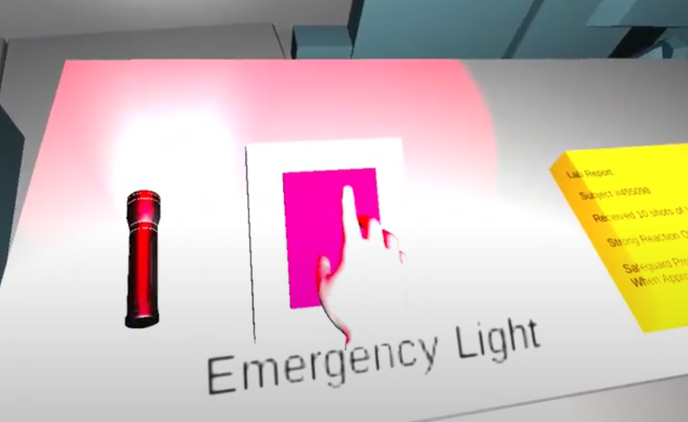  |  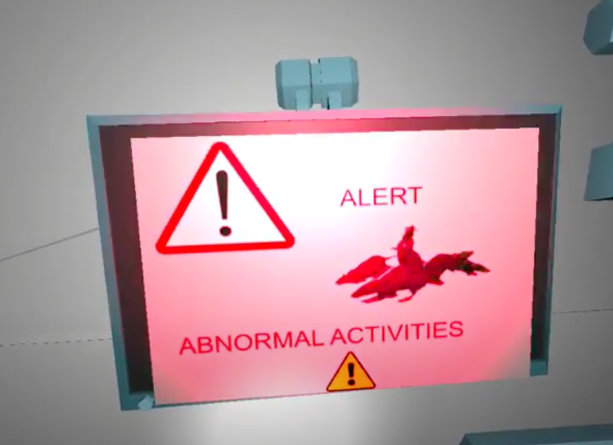

3. Grab the note to review lab details.

Note            |  Grab Note
:-------------------------:|:-------------------------:
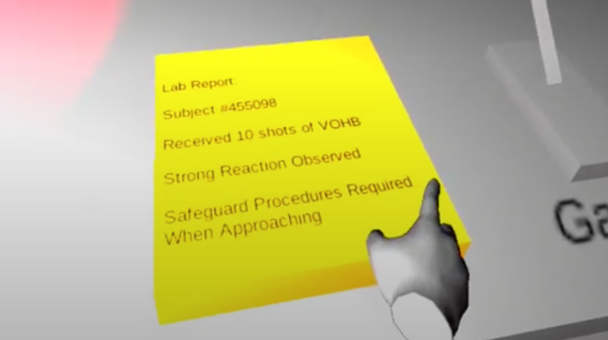  |  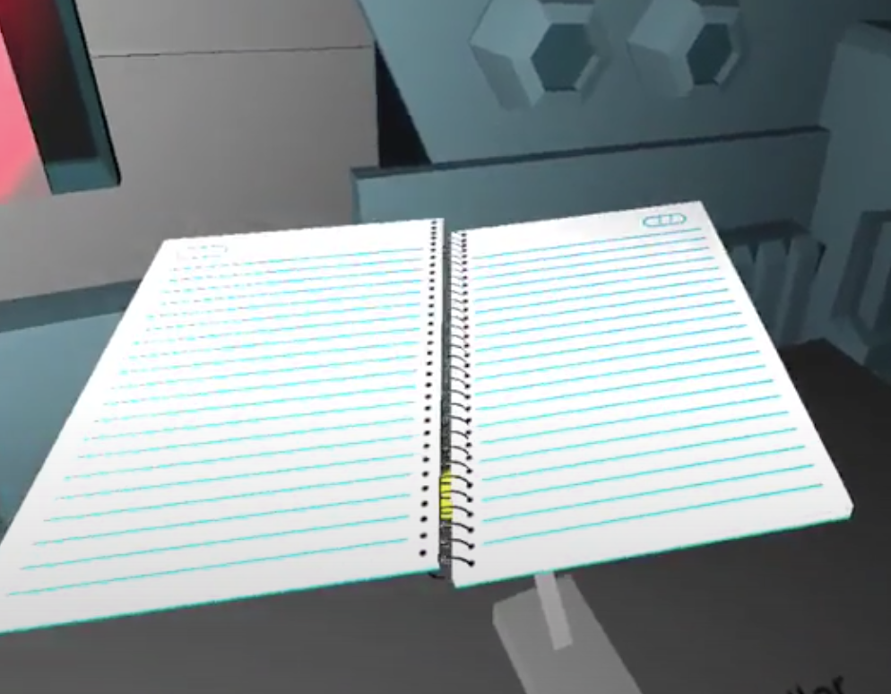

4. Pull the lever to open the gate and see the giant mouse.

Gate Controller            |  Gate Controller Pulled
:-------------------------:|:-------------------------:
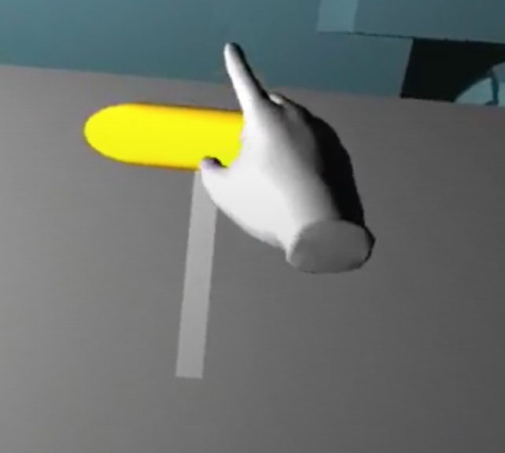  |  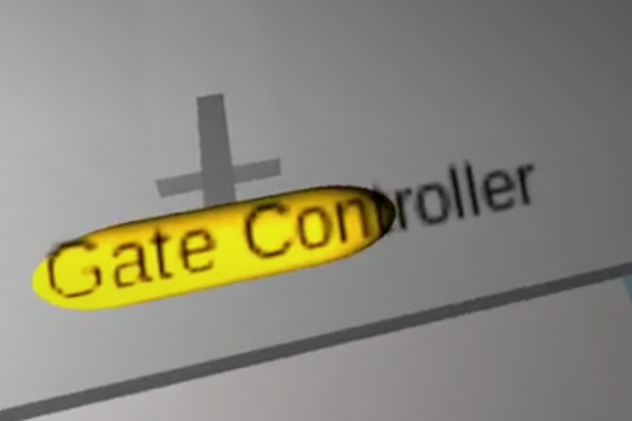

5. Grab the gun to be careful.

Gun            |  Grabbing Gun
:-------------------------:|:-------------------------:
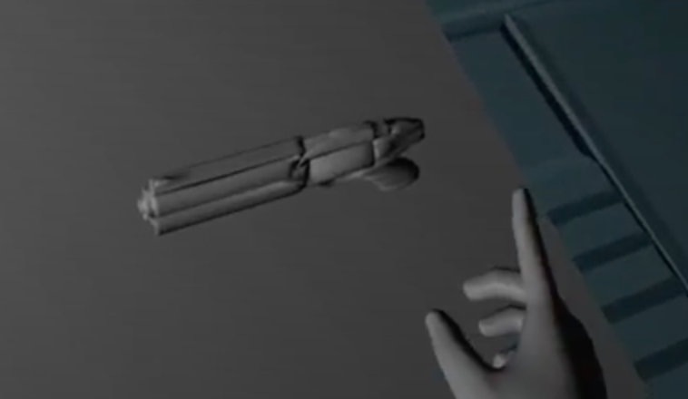  |  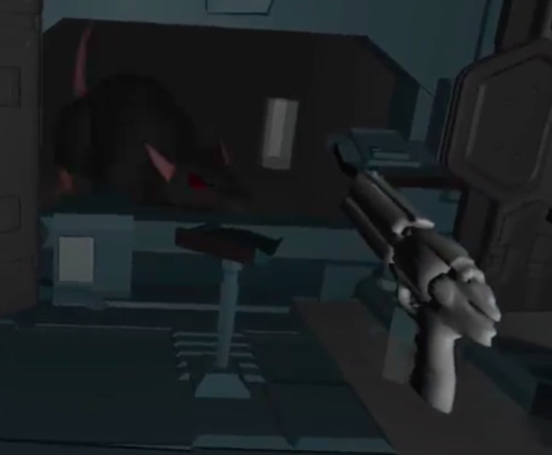

6. Use the gun to shoot the mouse and survived / Get killed by the mouse

Survive           |  Die
:-------------------------:|:-------------------------:
  |  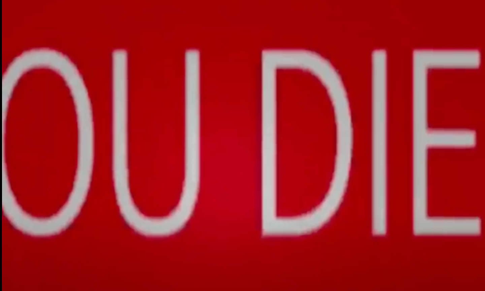

### Reflection：

What we learned in the Interaction Lab is really helpful for developing this project. We utilized and modified many prefabs from the lab. In addition to using the button and lever as a means to trigger interaction, we modified the launcher to make it like a gun. The idea came to us after we conducted user testing with some of our friends and they say that it would be nice if the player doesn’t always have to die and can make some changes towards the ending through certain interaction. Thus, even though we didn’t have time to make more interactions in the battle part, such as HP, or the action of chase and run, we modified the launcher so that it allowed us to make multiple endings for the experience triggered by whether the bullet hits the mouse first or the mouse touches the player first.

Personally I think the effect of the light of the flashlight in the beginning is pretty interesting. It allows the players to explore the scene and find out what the next step is on their own. The user testing results also indicate that players like the computer sound triggered by the button which can add to the narrative of the story and help the players learn the backstory. I utilized a free english reader application to generate that sound.
Our biggest obstacles in developing this project would be including the two end scenes. I first tried to switch scenes and it didn’t work. Then I tried canvas. It sort of worked but the text is still a bit weird. It’s just really difficult to adjust the right position of the canvas in front of the camera. Also we didn’t manage to make the ray interaction we originally intended, which is to use the flashlight to trigger the mouse to move more fiercely. If given more time we would explore more and also add more interactions with the mouse.
